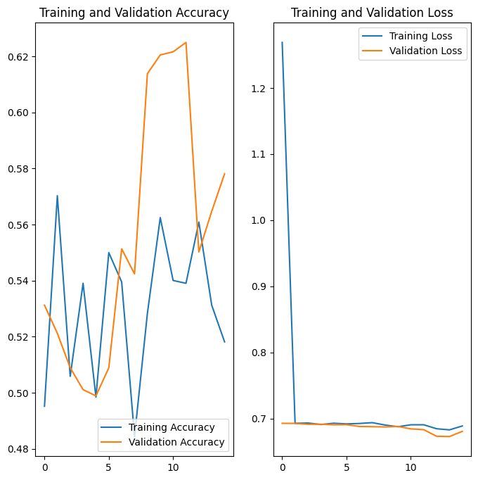

# Cat and Dog Image Classifier

This project implements a convolutional neural network (CNN) to classify images of cats and dogs, developed as part of the freeCodeCamp Machine Learning with Python certification. The goal is to create a CNN using TensorFlow 2.0 and Keras in Google Colab that achieves at least 63% accuracy on a test set of 50 images (extra credit for 70%+). The model uses image augmentation to prevent overfitting and is tested on a dataset with labeled training/validation sets and an unlabeled test set.

---

### Project Overview
The project involves:
1. Using `ImageDataGenerator` to load and preprocess images from the cats_and_dogs dataset, rescaling pixel values from 0-255 to 0-1.
2. Applying data augmentation (e.g., rotation, flipping) to the training set to improve generalization.
3. Building a CNN with Keras Sequential, featuring Conv2D, MaxPooling2D, and Dense layers, compiled with binary crossentropy loss and Adam optimizer.
4. Training the model on 2000 training images and validating on 1000 images, aiming for high validation accuracy.
5. Predicting probabilities (cat or dog) for 50 test images and visualizing results with confidence percentages.
6. Passing the challenge by achieving >=63% accuracy on the test set, verified by a provided test cell.

---

👨‍💻 **Author**: Ali Toori – Full-Stack Python Developer  
📺 **YouTube**: [@AliToori](https://youtube.com/@AliToori)  
💬 **Telegram**: [@AliToori](https://t.me/@AliToori)  
📂 **GitHub**: [github.com/AliToori](https://github.com/AliToori)

---

### [Google Colab Project Link](https://colab.research.google.com/drive/1jwf7bxxYvrg_ZnBXr8sQMam5sRezFCOw#scrollTo=la_Oz6oLlub6)

---
## Training and Validation Accuracy

---

## 🛠 Tech Stack
* Language: Python 3.8+
* Libraries:
  * TensorFlow 2.0+ (for CNN and image processing)
  * Keras (for model building)
  * Matplotlib (for visualizing images and training metrics)
  * NumPy (for array operations)
* Tools:
  * Google Colab for development, training, and testing (with GPU support)
  * GitHub for version control (optional, if you export the notebook)

---

## 📂 Project Structure
The project is a single Google Colab notebook (`Cat-Dog-Img-Classifier - fcc_cat_dog.ipynb`) with cells for:
- Importing libraries (TensorFlow, Keras, etc.)
- Downloading and setting up the cats_and_dogs dataset
- Creating image generators (train, validation, test)
- Defining and training the CNN model
- Visualizing training metrics and test predictions
- Testing accuracy against the challenge threshold (63%)

Dataset structure:
```bash
cats_and_dogs/
├── train/
│   ├── cats/ [cat.0.jpg, cat.1.jpg, ...]
│   ├── dogs/ [dog.0.jpg, dog.1.jpg, ...]
├── validation/
│   ├── cats/ [cat.2000.jpg, cat.2001.jpg, ...]
│   ├── dogs/ [dog.2000.jpg, dog.2001.jpg, ...]
├── test/ [1.jpg, 2.jpg, ...]
```

---

## Usage
1. Open the provided Colab notebook: https://colab.research.google.com/github/freeCodeCamp/boilerplate-cat-and-dog-image-classifier/blob/master/fcc_cat_dog.ipynb
2. Save a copy to your Google Drive (**File > Save a copy in Drive**).
3. Enable GPU for faster training (**Runtime > Change runtime type > GPU**).
4. Run all cells sequentially:
   - Cells 1-2: Import libraries and download dataset (~67MB).
   - Cell 3: Set up `ImageDataGenerator` for train/validation/test (rescale, `flow_from_directory`).
   - Cell 4: Visualize sample training images.
   - Cell 5: Add augmentation to training generator.
   - Cell 6: Visualize augmented images.
   - Cell 7: Build and compile CNN (Conv2D, MaxPooling, Dense).
   - Cell 8: Train model (15 epochs, adjustable).
   - Cell 9: Plot accuracy/loss curves.
   - Cell 10: Predict test set probabilities and visualize.
   - Cell 11: Check if accuracy >=63%.
5. If accuracy is low, adjust epochs (e.g., 20-30), batch size (e.g., 32), or model architecture (e.g., add Conv2D layers).

---

## Contributing
Contributions are welcome! To contribute:
1. Fork the repository (if you export the notebook to GitHub): https://github.com/AliToori/Cat-Dog-Image-Classifier
2. Create a feature branch (`git checkout -b feature-name`).
3. Commit changes (`git commit -m "Add feature"`).
4. Push to the branch (`git push origin feature-name`).
5. Open a pull request.
Alternatively, share an updated Colab notebook link via GitHub issues or Telegram.

---

## 🙏 Acknowledgments
- Built as part of the [freeCodeCamp Machine Learning with Python](https://www.freecodecamp.org/learn/machine-learning-with-python) certification.
- Uses TensorFlow/Keras for model development and Google Colab for cloud-based execution.
- Special thanks to freeCodeCamp for providing the challenge framework and dataset.

## 🆘 Support
For questions, issues, or feedback:

📺 YouTube: [@AliToori](https://youtube.com/@AliToori)  
💬 Telegram: [@AliToori](https://t.me/@AliToori)  
📂 GitHub: [github.com/AliToori](https://github.com/AliToori)